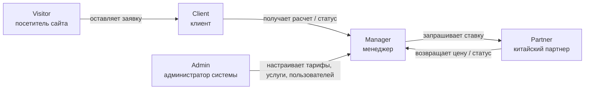
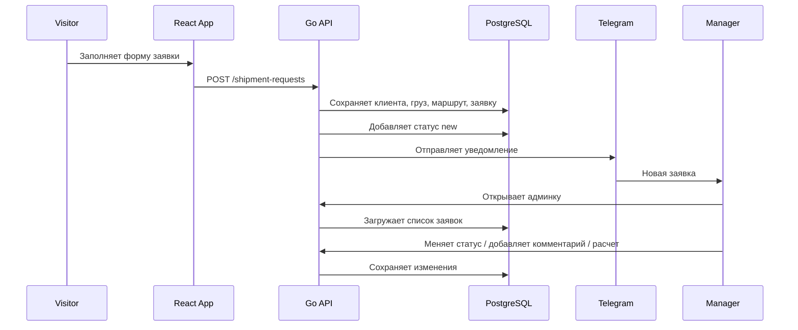
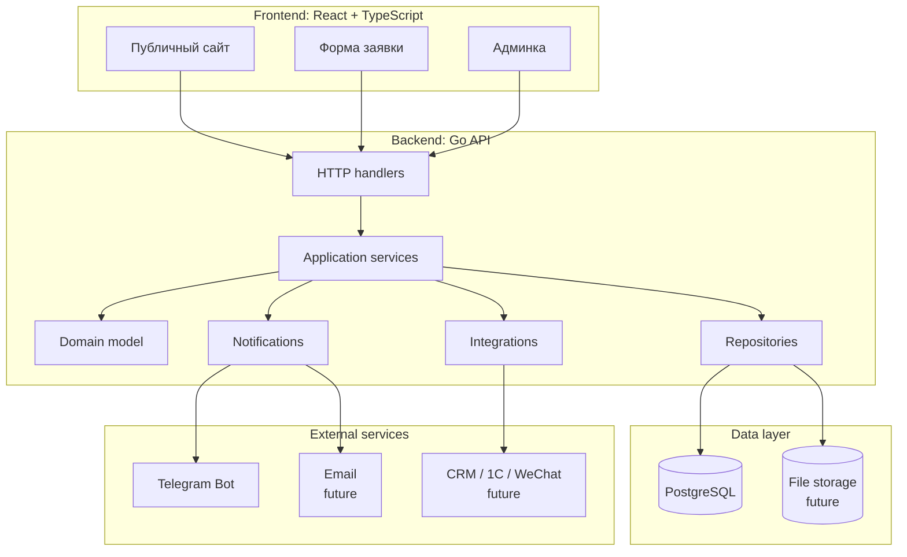
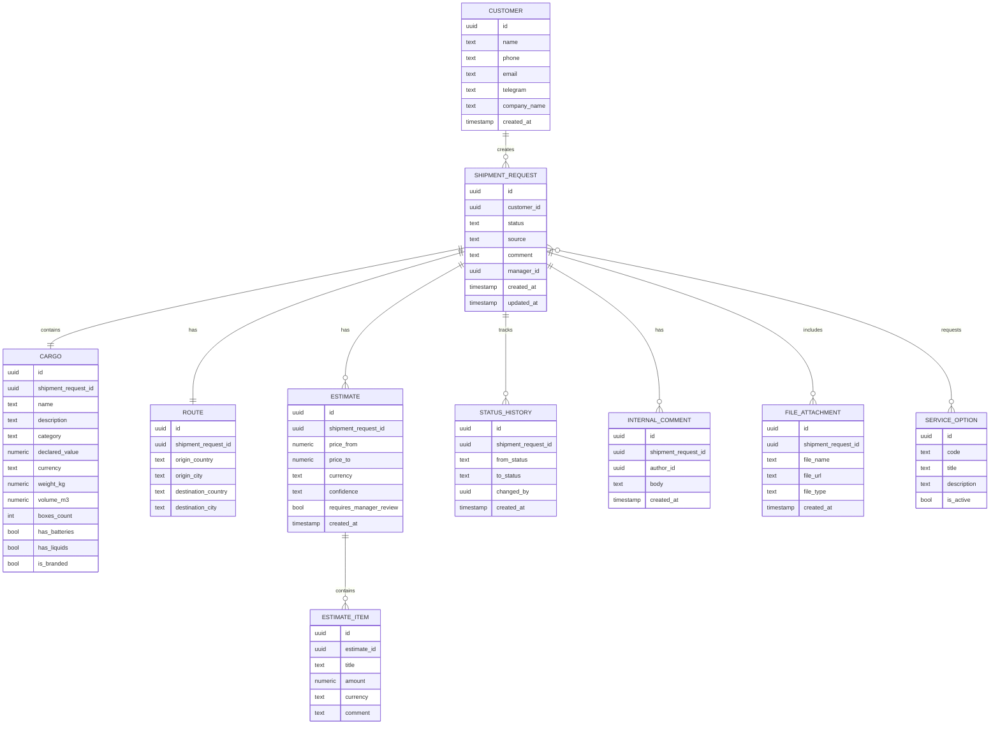
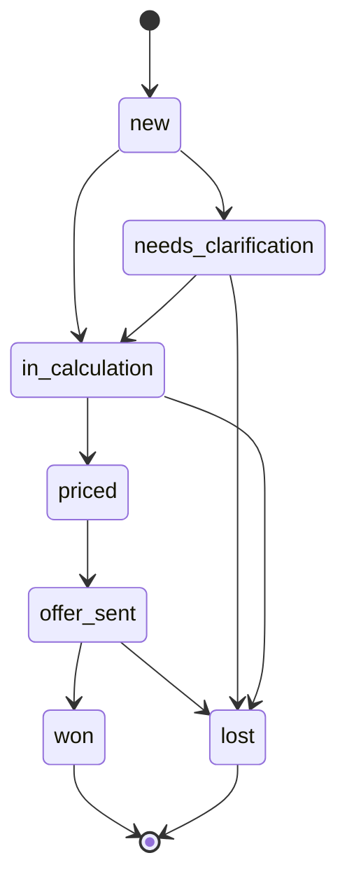
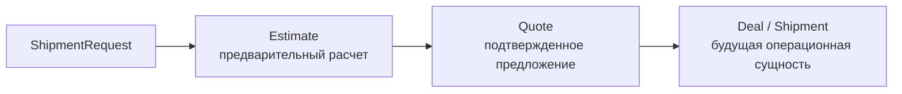
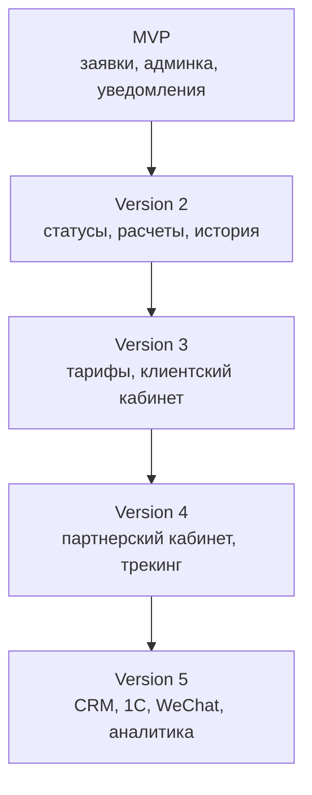

# IcarisLogistics Architecture

## Назначение Документа

Этот документ описывает архитектуру продукта для сервиса доставки из Китая в Россию.

Цель документа:

- зафиксировать понимание предметной области;
- показать связи между ролями, процессами и данными;
- отделить MVP от будущей платформы;
- служить учебной картой для проектирования backend, frontend и базы данных.

Документ должен обновляться по мере уточнения бизнес-процесса.

## Продуктовая Идея

Мы строим не просто калькулятор доставки, а платформу для обработки запросов на перевозку груза из Китая.

Публичный сайт и калькулятор являются входной точкой. Центральная сущность системы - заявка на перевозку.

```text
Клиент хочет:
- понять, можно ли доставить его товар;
- получить ориентир по цене и срокам;
- передать данные без долгой переписки;
- видеть понятный процесс.

Менеджер хочет:
- не терять заявки;
- быстро понимать вводные;
- запросить ставку у китайского партнера;
- подготовить предложение;
- вести клиента до завершения доставки.

Китайский партнер хочет:
- получить структурированный запрос;
- дать ставку;
- обновлять статусы;
- прикладывать документы, фото и комментарии.
```

## Роли



В MVP реально реализуем роли:

- `Visitor`;
- `Manager`;
- `Admin` в упрощенном виде.

Роли `Client` и `Partner` проектируются заранее, но полноценные кабинеты для них не входят в первый MVP.

## Главный Поток MVP



## Границы MVP

MVP должен закрыть один сквозной процесс:

```text
Клиент оставил заявку
-> система сохранила структурированные данные
-> менеджер получил уведомление
-> менеджер увидел заявку в админке
-> менеджер сменил статус
-> менеджер добавил комментарий или предварительный расчет
```

Входит в MVP:

- публичная страница с описанием услуги;
- форма заявки;
- backend API на Go;
- PostgreSQL;
- сохранение заявок;
- простая админка;
- статусы заявки;
- внутренние комментарии;
- Telegram-уведомление;
- предварительный расчет вручную или полуавтоматически.

Не входит в MVP:

- полноценный личный кабинет клиента;
- кабинет китайского партнера;
- интеграция с 1С;
- интеграция с WeChat;
- точный тарифный движок;
- онлайн-оплата;
- автоматический трекинг;
- документооборот;
- сложная аналитика.

## Слои Системы



## Backend Слои

Backend не должен превращаться в набор случайных обработчиков.

Базовый поток:

```text
HTTP handler
-> application service
-> domain logic
-> repository
-> database
```

Предлагаемая структура:

```text
cmd/api
internal/config
internal/http
internal/domain
internal/service
internal/repository
internal/db
internal/notification
internal/integration
```

Ответственность слоев:

- `http`: принимает HTTP-запросы, парсит JSON, возвращает ответы;
- `service`: выполняет бизнес-сценарии;
- `domain`: хранит основные типы и правила предметной области;
- `repository`: работает с базой данных;
- `notification`: отправляет Telegram/email;
- `integration`: будущие интеграции с CRM, 1С, WeChat.

## Центральная Domain-Модель

Главная сущность:

```text
ShipmentRequest
```

Это не просто лид и не просто результат формы. Это запрос на перевозку, который может пройти путь от первой заявки до доставки.

Основные сущности:

```text
Customer
ShipmentRequest
Cargo
Route
Estimate
EstimateItem
ServiceOption
StatusHistory
InternalComment
FileAttachment
```

## Связи Сущностей



## Жизненный Цикл Заявки

Статус заявки - это не декоративное поле, а описание бизнес-процесса.

MVP-статусы:

```text
new
needs_clarification
in_calculation
priced
offer_sent
won
lost
```



Будущие статусы после MVP:

```text
accepted
payment_pending
paid
cargo_expected_at_warehouse
cargo_received_in_china
inspection
consolidation
in_transit
customs_clearance
arrived_in_russia
last_mile_delivery
delivered
completed
```

## Estimate И Quote

Важно разделять предварительный расчет и финальное предложение.

```text
Estimate
```

Ориентировочный расчет. Может быть автоматическим или полуавтоматическим. Не является обещанием финальной цены.

```text
Quote
```

Финальное коммерческое предложение, подтвержденное менеджером. В MVP можно не делать отдельную сущность `Quote`, но архитектурно держим это различие.



## Данные Формы Заявки

Форма на сайте может быть короче, чем структура в базе.

Обязательные поля для первого MVP:

- имя;
- телефон или мессенджер;
- название груза;
- город отправки в Китае, если известен;
- город доставки в России;
- вес или объем;
- комментарий.

Желательные поля:

- email;
- название компании;
- стоимость груза;
- валюта;
- количество коробок;
- нужна ли помощь с выкупом;
- нужна ли таможня;
- есть ли поставщик;
- фото, инвойс или packing list.

Поля, которые не стоит требовать сразу:

- точный ТН ВЭД;
- полные габариты каждой коробки;
- юридические реквизиты;
- детальная структура документов.

Принцип:

```text
Форма должна быть достаточно простой для клиента,
но backend должен хранить данные структурно.
```

## Будущая Платформа

MVP должен быть первым слоем будущей системы, а не одноразовой формой.



## Открытые Вопросы

Эти вопросы нужно уточнять постепенно, не до начала разработки целиком:

- Какие услуги точно оказываем в первой версии?
- Какие маршруты наиболее важны?
- Как китайский партнер сейчас считает цену?
- Какие данные партнеру нужны для ставки?
- Кто будет менеджером в системе?
- Нужно ли хранить документы в MVP?
- Какой канал уведомлений первый: Telegram, email или оба?
- Нужно ли сразу делать авторизацию для админки?
- Будет ли сайт на одном языке или нужен китайский/английский позже?

## Ближайший Следующий Шаг

Следующий архитектурный шаг - подробно разобрать `ShipmentRequest`:

- какие поля обязательные;
- какие поля опциональные;
- какие поля заполняет клиент;
- какие поля заполняет менеджер;
- какие поля нужны только будущим версиям;
- какие таблицы появятся в первой миграции.

